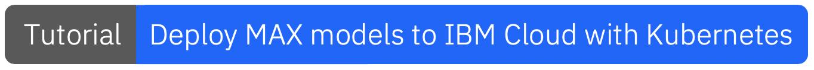
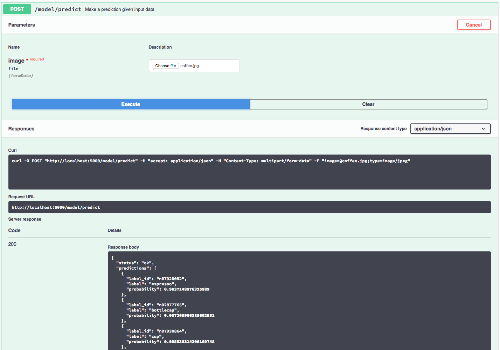

[](https://travis-ci.com/IBM/MAX-ResNet-50) [](http://max-resnet-50.codait-prod-41208c73af8fca213512856c7a09db52-0000.us-east.containers.appdomain.cloud)

[](http://ibm.biz/max-to-ibm-cloud-tutorial)

# IBM Code Model Asset Exchange: ResNet-50 Image Classifier

This repository contains code to instantiate and deploy an image classification model. This model recognizes the 1000 different classes of objects in the [ImageNet 2012 Large Scale Visual Recognition Challenge](http://www.image-net.org/challenges/LSVRC/2012/). The model consists of a deep convolutional net using the ResNet-50 architecture that was trained on the ImageNet-2012 data set. The input to the model is a 224x224 image, and the output is a list of estimated class probabilities.

The model is based on the [Keras built-in model for ResNet-50](https://keras.io/applications/#resnet50). The model files are hosted on [IBM Cloud Object Storage](https://max-cdn.cdn.appdomain.cloud/max-resnet50/1.0.0/assets.tar.gz). The code in this repository deploys the model as a web service in a Docker container. This repository was developed as part of the [IBM Code Model Asset Exchange](https://developer.ibm.com/code/exchanges/models/) and the public API is powered by [IBM Cloud](https://ibm.biz/Bdz2XM).

## Model Metadata
| Domain | Application | Industry  | Framework | Training Data | Input Data Format |
| ------------- | --------  | -------- | --------- | --------- | -------------- | 
| Vision | Image Classification | General | Keras | [ImageNet](http://www.image-net.org/) | Image (RGB/HWC)|

## References

* _K. He, X. Zhang, S. Ren and J. Sun_, ["Deep Residual Learning for Image Recognition"](https://arxiv.org/pdf/1512.03385), CoRR (abs/1512.03385), 2015.
* [Keras Applications](https://keras.io/applications/#resnet50)

## Licenses

| Component | License | Link  |
| ------------- | --------  | -------- |
| This repository | [Apache 2.0](https://www.apache.org/licenses/LICENSE-2.0) | [LICENSE](LICENSE) |
| Model Weights | [MIT](https://opensource.org/licenses/MIT) | [Keras ResNet-50](https://keras.io/applications/#resnet50)|
| Model Code (3rd party) | [MIT](https://opensource.org/licenses/MIT) | [Keras LICENSE](https://github.com/keras-team/keras/blob/master/LICENSE)|
| Test assets | Various | [Samples README](samples/README.md) |

## Pre-requisites:

* `docker`: The [Docker](https://www.docker.com/) command-line interface. Follow the [installation instructions](https://docs.docker.com/install/) for your system.
* The minimum recommended resources for this model is 2GB Memory and 2 CPUs.
* If you are on x86-64/AMD64, your CPU must support [AVX](https://en.wikipedia.org/wiki/Advanced_Vector_Extensions) at the minimum.

# Deployment options

* [Deploy from Quay](#deploy-from-quay)
* [Deploy on Red Hat OpenShift](#deploy-on-red-hat-openshift)
* [Deploy on Kubernetes](#deploy-on-kubernetes)
* [Run Locally](#run-locally)

## Deploy from Quay

To run the docker image, which automatically starts the model serving API, run:

```
$ docker run -it -p 5000:5000 quay.io/codait/max-resnet-50
```

This will pull a pre-built image from the Quay.io container registry (or use an existing image if already cached locally) and run it.
If you'd rather checkout and build the model locally you can follow the [run locally](#run-locally) steps below.

## Deploy on Red Hat OpenShift

You can deploy the model-serving microservice on Red Hat OpenShift by following the instructions for the OpenShift web console or the OpenShift Container Platform CLI [in this tutorial](https://developer.ibm.com/tutorials/deploy-a-model-asset-exchange-microservice-on-red-hat-openshift/), specifying `quay.io/codait/max-resnet-50` as the image name.

## Deploy on Kubernetes

You can also deploy the model on Kubernetes using the latest docker image on Quay.

On your Kubernetes cluster, run the following commands:

```
$ kubectl apply -f https://raw.githubusercontent.com/IBM/MAX-ResNet-50/master/max-resnet-50.yaml
```

The model will be available internally at port `5000`, but can also be accessed externally through the `NodePort`.

A more elaborate tutorial on how to deploy this MAX model to production on [IBM Cloud](https://ibm.biz/Bdz2XM) can be found [here](http://ibm.biz/max-to-ibm-cloud-tutorial).

## Run Locally

1. [Build the Model](#1-build-the-model)
2. [Deploy the Model](#2-deploy-the-model)
3. [Use the Model](#3-use-the-model)
4. [Development](#4-development)
5. [Cleanup](#5-cleanup)


### 1. Build the Model

Clone this repository locally. In a terminal, run the following command:

```
$ git clone https://github.com/IBM/MAX-ResNet-50.git
```

Change directory into the repository base folder:

```
$ cd MAX-ResNet-50
```

To build the docker image locally, run: 

```
$ docker build -t max-resnet-50 .
```

All required model assets will be downloaded during the build process. _Note_ that currently this docker image is CPU only (we will add support for GPU images later).

### 2. Deploy the Model

To run the docker image, which automatically starts the model serving API, run:

```
$ docker run -it -p 5000:5000 max-resnet-50
```

### 3. Use the Model

The API server automatically generates an interactive Swagger documentation page. Go to `http://localhost:5000` to load it. From there you can explore the API and also create test requests.

Use the `model/predict` endpoint to load a test image (you can use one of the test images from the `samples` folder) and get predicted labels for the image from the API.



You can also test it on the command line, for example:

```
$ curl -F "image=@samples/coffee.jpg" -XPOST http://localhost:5000/model/predict
```

You should see a JSON response like that below:

```json
{
  "status": "ok",
  "predictions": [
    {
      "label_id": "n07920052",
      "label": "espresso",
      "probability": 0.9637148976326
    },
    {
      "label_id": "n02877765",
      "label": "bottlecap",
      "probability": 0.007265966385603
    },
    {
      "label_id": "n07930864",
      "label": "cup",
      "probability": 0.0059303143061697
    },
    {
      "label_id": "n07693725",
      "label": "bagel",
      "probability": 0.0023403959348798
    },
    {
      "label_id": "n04476259",
      "label": "tray",
      "probability": 0.0019735493697226
    }
  ]
}
```

### 4. Development

To run the Flask API app in debug mode, edit `config.py` to set `DEBUG = True` under the application settings. You will then need to rebuild the docker image (see [step 1](#1-build-the-model)).

### 5. Cleanup

To stop the Docker container, type `CTRL` + `C` in your terminal.

## Train this Model on Watson Machine Learning

This model supports training from scratch on a custom dataset. Please follow the steps listed under the [training README](training/README.md) to retrain the model on [Watson Machine Learning](https://www.ibm.com/cloud/machine-learning), a deep learning as a service offering of [IBM Cloud](https://ibm.biz/Bdz2XM).

## Resources and Contributions
   
If you are interested in contributing to the Model Asset Exchange project or have any queries, please follow the instructions [here](https://github.com/CODAIT/max-central-repo).
